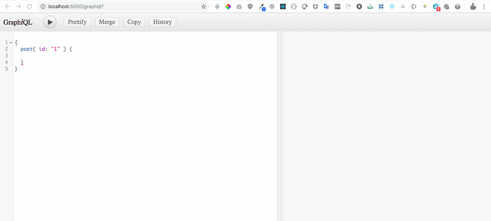

# GraphQL React Application

## Description :clipboard:
> A GraphQL workshop to learn GraphQL implementations in JavaScript,

## GraphQL App DEMO :video_camera:

## Built With :zap:
1. GraphQL
2. React
3. Apollo Client
4. External dependency [wp-graphql](https://github.com/wp-graphql/wp-graphql) ( for `graphql-with-wordpress` branch )
5. Express
6. Node js
7. create-react-app ( uses Babel and Webpack )

## Details :scroll:

1. :arrow_right: We have set up our backend server in node and express app ( `localhost:5000/graphql` ) in `server.js`.
2. :arrow_right: React application is set up using [create-react-app](https://github.com/facebook/create-react-app) ( that runs webpack-dev-server for the frontend on `localhost:3000` )
3. :arrow_right: The schema and graphQl queries are created in `schema.js`
4. :arrow_right: We have used [wp-graphql](https://github.com/wp-graphql/wp-graphql) WordPress plugin that brings the power of GraphQL to WordPress. 
5. :arrow_right: GraphiQL playground is available on `localhost:5000/graphql`.
6. :arrow_right: We have used Apollo Client to build UI in React that fetches data from GraphQL. Apollo client help us create a query and binds our React component with the query, so that when component renders, and handles any queries to GraphQl server and return the results.
7. :arrow_right: We import `<Apolloclient>` from `apollo-boost` and create a new object called `client` and pass the url for our GraphQL endpoint into this object.
8. :arrow_right: We wrap our main React Component `<AppoloProvider>` and apollo `client` is then passed to these components, so that the results of your query can be passed to your components.
9. :arrow_right: The `graphql-tag` ( graphQl query parsing utility ) is installed and `gpl` is imported from it. The `gpl` parses GraphQL query strings into the standard GraphQL AST.
10. :arrow_right: Use `gpl` to query the data in front react app, from the schema we have create in our node application in backend.
11. :arrow_right: We have displayed all the data received as response of the query on home page( `Home.js` ).

## GraphiQL Playground DEMO :video_camera:

## Installation :wrench:

1. Clone this repo by running `git clone https://github.com/imranhsayed/graphql-workshop`
2. `npm install`
3. `npm run dev`

## Branches Information:

1. * [master](https://github.com/imranhsayed/graphql-workshop) Creates a GraphQL server using express and nodejs and adds an endpoint at `localhost:5000/graphql`, where you can send all your query request.
   * It has Apollo client with React on front end .
2. [graphql-with-wordpress](https://github.com/imranhsayed/graphql-workshop/tree/graphql-with-wordpress) uses GraphQL server created by [wp-graphql](https://github.com/wp-graphql/wp-graphql) plugin on your WordPress install and React in frontend. More info is in that branch's read me.

## Plugins for GraphQL with WordPress :electric_plug:

For `graphql-with-wordpress` branch Clone these repositories into plugin directory of your WordPress Install and activate them from WordPress dashboard.

1. [wp-graphql](https://github.com/wp-graphql/wp-graphql)
2. [wp-graphiql](https://github.com/wp-graphql/wp-graphiql)

## Instructions :point_right:

* `Graphiql` is a tool that we can use as a client to make request to our server.
* Graph QL endpoint where you can send your query request: `localhost:5000/graphql`

## Common Commands :computer:

You can run these commands from root directory.

1. `npm run dev` runs webpack-dev-server for frontend on port 3000 in watch mode and backend server on port 5000. ( Uses concurrently package to run the two servers together,
 so the below two command are not required to run if you run this ).
2. `npm run dev:client` starts webpack dev server for React on port `5000`
3. `npm run dev:server` starts nodejs server on port `3000`
4. `npm run prod:client` runs the build for production for client.

## Useful Links :link:

1. [Express GraphQL github link](https://github.com/graphql/express-graphql)
2. [Apollo GraphQL](https://www.apollographql.com/docs/react/) 

Apollo Client is way to use GraphQL to build client applications. It helps you build a UI that fetches data with GraphQL, and can be used with any JavaScript front-end.
When two components need the same data. If an action triggers an update on update, the second one won’t be updated . Apollo solves this using `reactive cache` feature.
Its main job is fetch some GraphQL queries and keep them in sync with one another

## Thank you Note 🙏 

I would like to thank 🙏 everyone who attended the [GraphQL with React and WordPress Meet](https://www.meetup.com/Pune-WordPress-Knowledge-Exchange/events/264252479/) up on Sep 21, 2019.
The session wouldn't have been so enjoyable and fruitful without your presence.😊 

📹[MeetUp Highlights](http://bit.ly/2kXSGJF)

📷[Twitter Post with Snaps](https://bit.ly/2ksCnEv)

## License

- **[MIT license](http://opensource.org/licenses/mit-license.php)**
